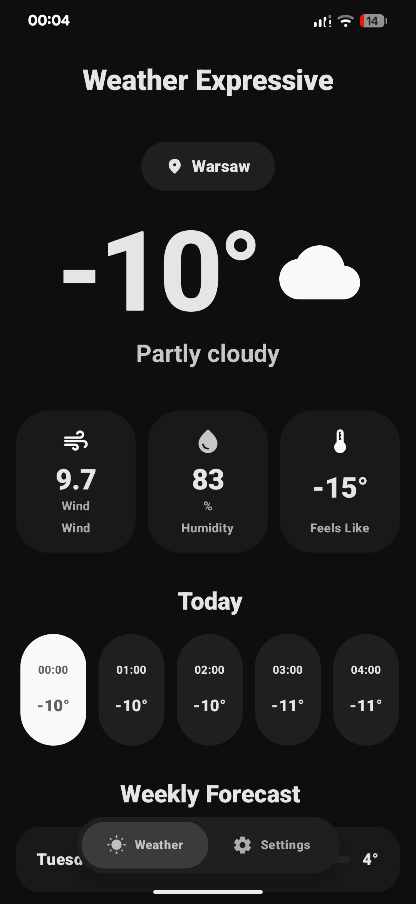
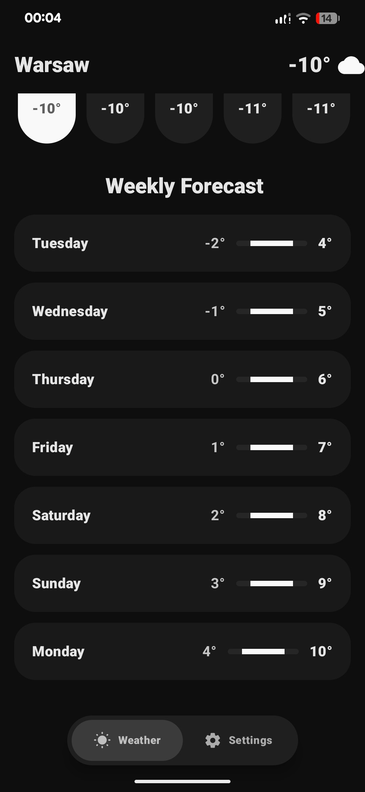
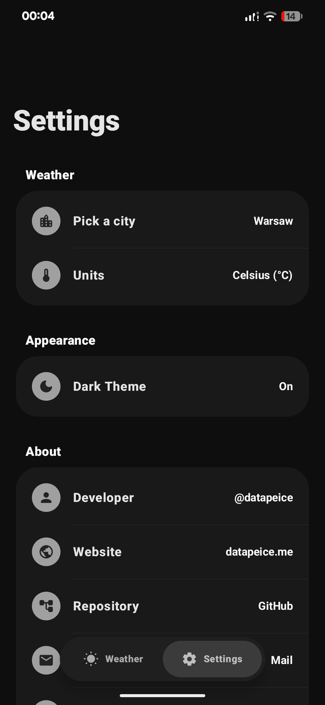

<div align="center">
  <svg width="200px" height="200px" viewBox="0 0 108 108">
    <circle cx="54" cy="54" r="54" fill="#B3B3B3"/>
    <g transform="translate(24, 24) scale(0.58, 0.58)">
      <path
          d="M21.499,40C22.327,40 22.999,40.672 22.999,41.5C22.999,42.328 22.327,43 21.499,43C20.67,43 19.999,42.328 19.999,41.5C19.999,40.672 20.67,40 21.499,40ZM30.499,40C31.327,40 31.999,40.672 31.999,41.5C31.999,42.328 31.327,43 30.499,43C29.67,43 28.999,42.328 28.999,41.5C28.999,40.672 29.67,40 30.499,40ZM16.999,38C17.827,38 18.499,38.672 18.499,39.5C18.499,40.328 17.827,41 16.999,41C16.17,41 15.499,40.328 15.499,39.5C15.499,38.672 16.17,38 16.999,38ZM25.999,38C26.827,38 27.499,38.672 27.499,39.5C27.499,40.328 26.827,41 25.999,41C25.17,41 24.499,40.328 24.499,39.5C24.499,38.672 25.17,38 25.999,38ZM34.999,38C35.827,38 36.499,38.672 36.499,39.5C36.499,40.328 35.827,41 34.999,41C34.17,41 33.499,40.328 33.499,39.5C33.499,38.672 34.17,38 34.999,38ZM25.999,12.01C32.336,12.01 35.931,16.204 36.454,21.27L36.614,21.27C40.692,21.27 43.998,24.567 43.998,28.635C43.998,32.703 40.692,36 36.614,36L15.384,36C11.306,36 8,32.703 8,28.635C8,24.567 11.306,21.27 15.384,21.27L15.544,21.27C16.07,16.171 19.662,12.01 25.999,12.01ZM13.178,4.002C14.768,4.088 16.312,4.546 17.704,5.35C19.814,6.568 21.322,8.429 22.122,10.543C18.106,11.687 15.245,14.626 14.095,18.592L14.003,18.924L13.888,19.4L13.475,19.477C11.184,19.958 9.198,21.28 7.859,23.109L7.55,22.937L7.55,22.937C6.235,22.178 5.118,21.147 4.265,19.909C3.706,19.097 4.068,17.976 4.996,17.644C8.281,16.468 10.051,15.145 11.063,13.212C12.169,11.102 12.373,8.864 11.639,5.858C11.4,4.88 12.173,3.948 13.178,4.002Z"
          fill="#212121"/>
    </g>
  </svg>

  # Weather Expressive

  ### A weather app for Android designed with Material You
  
</div>

## Screenshots

<div align="center">
  <div>
    
    
    
  </div>
</div>

## Technical Stack

* **Language**: Kotlin
* **UI Framework**: Jetpack Compose (Material Design 3 Implementation)
* **Architecture**: MVVM (Model-View-ViewModel)
* **Networking**: Retrofit 2 / OkHttp
* **Concurrency**: Kotlin Coroutines
* **Dependency Injection**: Manual ViewModel Provisioning
* **Data Persistence**: DataStore / SharedPreferences

## Installation

1. Clone the repository:
   ```bash
   git clone https://github.com/datapeice/weatherexpressive.git
   ```
2. Open the project in Android Studio.
3. Synchronize Gradle files.
4. Build and run the application on an emulator or physical device (API Level 24+).

## Project Structure
- `data/`: Contains repositories, models, and network API definitions.
- `ui/`: Contains UI components, themes, and screen implementations.
- `viewmodel/`: Contains business logic and state management.
- `utils/`: Contains helper classes for formatting and unit conversion.

## License
This project is licensed under the BSD 2-Clause License - see the LICENSE file for details.